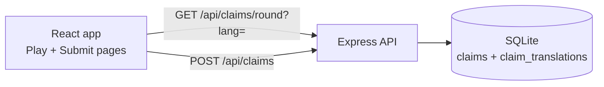

```mermaid
flowchart LR
  A["React app<br/>Play + Submit pages"] -->|"GET /api/claims/round?lang="| B["Express API"]
  A -->|"POST /api/claims"| B
  B --> C[("SQLite<br/>claims + claim_translations")]
```

The UI fetches with lang, Express joins claims with claim_translations, and SQLite returns reviewed Spanish/English fallbacks.